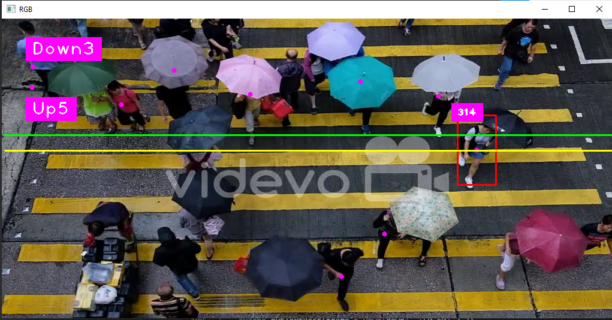

# People Counting with YOLO Algorithm

## Introduction

This repository contains the code for a computer vision project that focuses on counting people in real-world scenarios using the YOLO (You Only Look Once) algorithm. During my internship at V3 Analytics, I had the privilege of contributing to this exciting project, which provided me with valuable experience in Python libraries and Statistics for Data Analytics.

## Project Overview

The main objective of this project was to develop a robust system capable of accurately counting the number of individuals in various environments. By leveraging the power of the YOLO algorithm, we were able to efficiently detect and track people in real-time, enabling more effective resource allocation and decision-making in crowd management, security, and various other domains.

## Sample Output

The sample output above demonstrates the effectiveness of the developed system. The algorithm successfully detects and highlights each individual present in the scene, along with a count of the total number of people identified.

## Getting Started

To run the project on your local machine, follow these steps:

1. Clone the repository to your system.
2. Install the required Python libraries by running `pip install -r requirements.txt`.
3. Execute the `people_counting.py` script using Python.

Feel free to explore the code and adjust parameters to adapt the system to different scenarios.

## Acknowledgments

I would like to express my gratitude to the team at V3 Analytics for providing me with the opportunity to work on this project and gain invaluable experience in the field of computer vision and data analytics.

## Contact

If you have any questions, suggestions, or collaboration opportunities, please feel free to reach out to us at [poornasiva1@gmail.com](mailto:poornasiva1@gmail.com) or [sandeepkumarptkm@gmail.com](mailto:sandeepkumarptkm@gmail.com).

---
**Note**: The sample output image (`sample_output.png`) is a representative example and does not reflect real-world data or sensitive information. The image is provided for demonstration purposes only.

